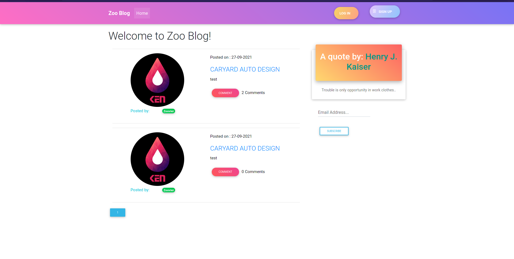

# ZOO BLOG
a personal blogging website where you can create and share your opinions and other users can read and comment on them. Additionally, add a feature that displays random quotes to inspire your users. 

## User story
1. As a user, I would like to view the blog posts on the site
2. As a user, I would like to comment on blog posts
3. As a user, I would like to view the most recent posts
4. As a user, I would like to an email alert when a new post is made by joining a subscription.
5. As a user, I would like to see random quotes on the site
6. As a writer, I would like to sign in to the blog.
7. As a writer, I would also like to create a blog from the application.
8. As a writer, I would like to delete comments that I find insulting or degrading.
9. As a writer, I would like to update or delete blogs I have created.

## Project Objectives
* Your project should have a functioning authentication system
* Your project should contain migration files for the different model structure
* Your project must have a user model
* Your project should consume a quotes API
* Your project should have a comment model
* Your project should have a profile page.

## Showcase

## Live Site

[link to deployed site]()